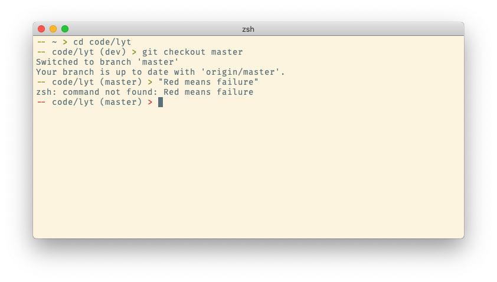

# Pelles Own Prompt

This is the repository for my very on zsh prompt. The prompt designed with
simplicity and utility in mind, without all the bells and whistles found in 
other prompts, so you can write your commands without unnecessary disturbances.

The prompt features
```
    ↓ Two dashes to make it easy to identify lines with commands.
       ↓ The top two directories of the current path so you can see where
         you're at.
              ↓ A minimal non-fancy prompt symbol. 
    -- ~/code >

    The leading dash and prompt symbold are colored red if the previous 
    command failed.
```

## Installation

* Move *pelles-own-prompt.zsh-theme* to *~/.oh-my-zsh/themes*
* Change your *.zshrc* file to set `ZSH_THEME="pelles-own-prompt"`
